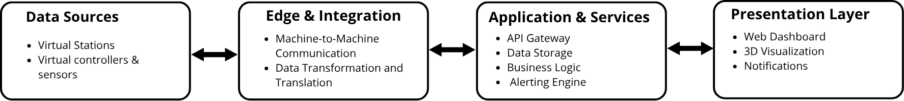
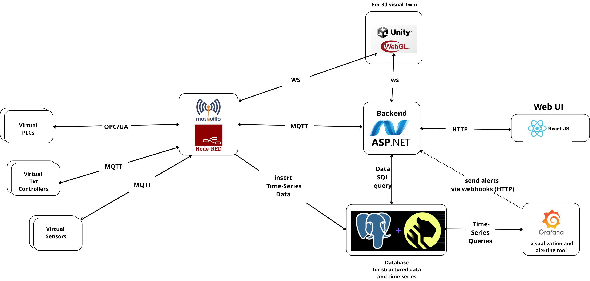
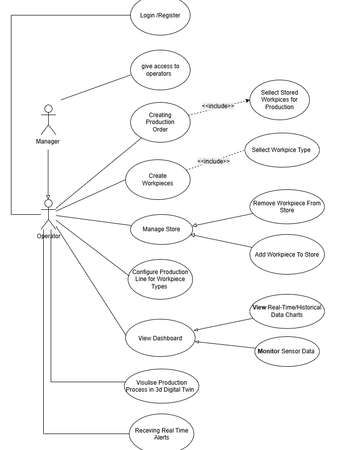
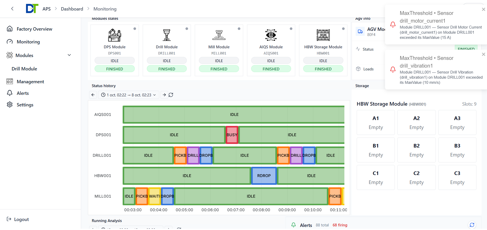
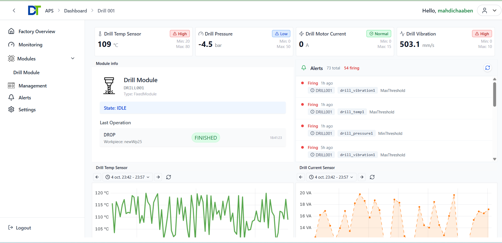
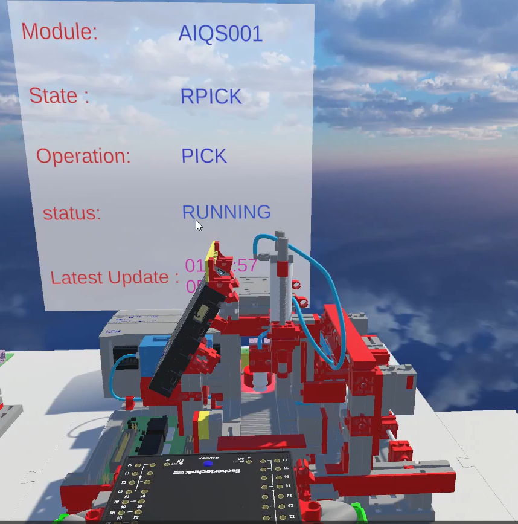
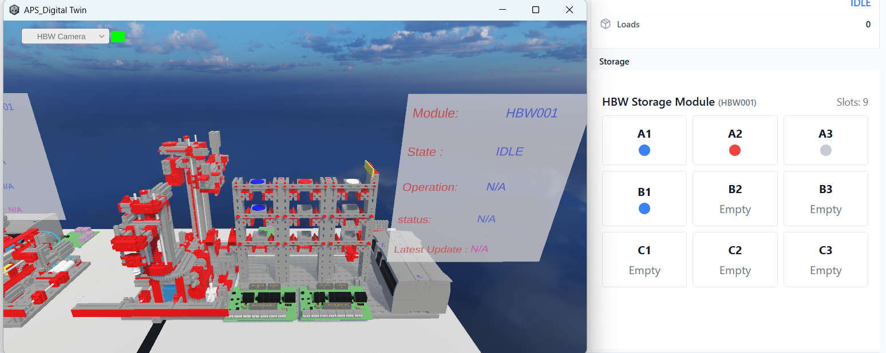

# Digital Twin Dashboard for Smart Factory

> **Industry 4.0 Smart Dashboard & Visualization Platform**

A multi-layered digital twin platform for monitoring and controlling automated production systems in real-time. Virtualizes fischertechnik APS stations with edge integration, event-driven backend, and interactive 3D visualization.

---

## 🎯 Overview

Full-stack platform bridging physical manufacturing equipment with digital services:

- **Real-time monitoring** of production modules, sensors, and workpiece flows
- **Time-series analytics** with PostgreSQL/TimescaleDB and Grafana
- **Virtual stations** simulating Drill, Mill, HBW Storage, AIQS, DPS modules
- **3D visualization** using Unity WebGL
- **Alert management** with webhook notifications
- **Full traceability** of production orders and operations

---

## 🏗️ Architecture

### Four-Layer Design

**Layer 1: Data Sources** - Virtual OPC UA servers simulating production stations  
**Layer 2: Edge & Integration** - Node-RED + Mosquitto MQTT for protocol bridging (OPC UA ↔ MQTT)  
**Layer 3: Application & Services** - ASP.NET Core API + PostgreSQL/TimescaleDB  
**Layer 4: Presentation** - React dashboard + Unity 3D + Grafana

---

## 🎨 System Model

### Use Case Diagram

**Manager Role:** User registration, access control, system administration  
**Operator Role:** Production orders, workpiece management, monitoring, 3D twin visualization, alerts

###  Class Diagram for Domain Entities

%20(1).png)

**Core Entities:** User, Factory, Order (Production/Store), Workpiece, DigitalElement (FixedModule/TransportModule), Command, Sensor, Alert, Logs (Module/Sensor/Workpiece)

---

## ✨ Key Features

- **Real-time data streaming** via MQTT (<100ms latency)
- **Event-driven architecture** with domain events
- **Production order tracking** with multi-station orchestration
- **Sensor monitoring** with threshold-based alerts
- **3D digital twin** with WebSocket synchronization
- **Grafana dashboards** for KPIs and historical analysis

---

## 🛠️ Technology Stack

**Backend:** ASP.NET Core, Entity Framework Core, PostgreSQL, TimescaleDB  
**Frontend:** React + TypeScript, Vite, TailwindCSS  
**Edge:** Node-RED, Mosquitto MQTT, Python OPC UA  
**Visualization:** Grafana, Unity WebGL  
**DevOps:** Docker, Docker Compose

---

## � Screenshots

### Dashboard with Alerts

### Sensor Monitoring

### 3D Digital Twin

---
## 🔗 Resources

- **Demo Video:** [Watch on YouTube](https://www.youtube.com/watch?v=sUNCbplIqJw&feature=youtu.be)
- **Issues:** [GitHub Issues](https://github.com/mahdichaaben/DigitalTwin-Dashboard-For-APS/issues)

---

**Built with ❤️ for Industry 4.0**
